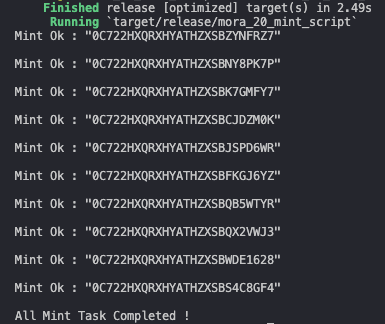

# 批量打 Mora-20 铭文 Rust 脚本

[索引标准](https://mora.app/planet/qvsfp-6aaaa-aaaan-qdbua-cai/0C6YXTY4BP1XXQ9G8X7VJ9MTCA)

# 如何使用

1. 在 [Plug](https://plugwallet.ooo/) 创建一个账号并导出 `.PEM` 文件，放到代码根目录下，并命名为 `identity.pem`

2. 在 Mora 的星球管理页面给刚才导出的账号添加星球写作者权限

3. 在 `main.rs` 文件自定义铭文信息
```rust

```

运行效果 :



